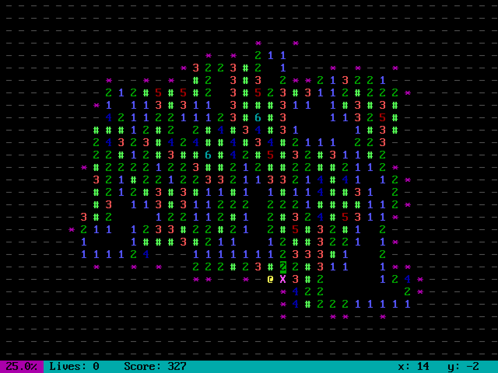

# pymines

Infinite minesweeper game



## About

This game implementation uses sets instead of arrays:

```py
# array logic
if grid[x][y].is_mine:
    ...

# set logic
if (x, y) in coordinates.mines:
    ...
```

The result of this simple change is that the game can progress indefinitely without the need to explicitly resize arrays.

### C++ ~~Rant~~ Comparison

I originally prototyped this game in Python, then wrote it [in C++](https://github.com/peppermintpatty5/cpp-mines), and then rewrote it here in Python.

This program was much easier to write in Python than in C++. For such a bloated language, C++ lacks many useful features.

1. C++ `std::unordered_set` cannot be used directly with `std::pair`. I had to write a hash function that basically treated `std::pair<long, long>` as a string.
2. Python integers have unlimited precision whereas C++ has no such data type. Expect to see integer overflow once you move the cursor past `LONG_MIN` or `LONG_MAX`.
3. It took until C++20 for `std::unordered_set` to get the [`contains`](https://en.cppreference.com/w/cpp/container/unordered_set/contains) method. Previous versions of C++ had to use the iterator syntax.

## Installation

This project requires Python 3.10 or newer and uses only the standard library. You do not need to install anything else, unless you are on Windows:

> The Windows version of Python doesn't include the [`curses`](https://docs.python.org/3/library/curses.html#module-curses) module. A ported version called [UniCurses](https://pypi.org/project/UniCurses) is available.

## Usage

Simply run `main.py`. Use the `-h` flag to see the help text.

```sh
python3 main.py -h
```

### Controls

|       Key       | Action                       |
| :-------------: | :--------------------------- |
|   Arrow keys    | Move cursor                  |
|      Enter      | Uncover cell at cursor       |
|      Space      | Flag or chord cell at cursor |
| `w` `s` `a` `d` | Scroll window (fine)         |
| `W` `S` `A` `D` | Scroll window (coarse)       |
|       `0`       | Scroll to (0, 0)             |
|       `c`       | Center window to cursor      |
|       `r`       | Refresh window               |
|       `q`       | Quit                         |

Have fun! :infinity:
